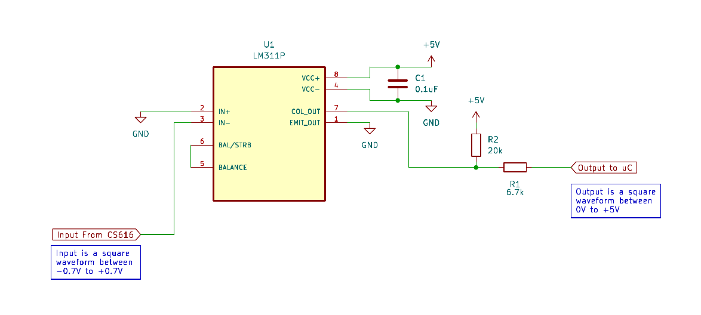

# Reading CS616

The CS616 is a moisture sensor from Campbell. It measures the soil moisture using the TDR (Time domain relfectometry) technique. 
This is an efficient and accurate way to measure soil moisture. These sensors output a square wave with a period proportional to the soil moisture.
The output period is above 10uS so readable by an Arduino with a clock speed of 8MHz. Unfortunately the output is a square wave from -0.7V to 0.7V which is not readable by the input pin of a 5V arduino micro-controller. 

This project aims to read CS616 soil moisture sensors using any 5V microcontroller (arduino Uno in this project).

## Simple Schematic to read one sensor using a 5V micro-controller
To convert the output of the sensor into something readable by a 5V uC we use a fast differential comparator, the LM311P. This idea was inspired by the design of a frequency counter found online [here](https://www.ee-diary.com/2022/07/high-frequency-counter-with-arduino.html#). Their design was adapted using an example circuit found in the datasheet of the comparator. 

## Reading multiple CS616 sensors using one micro-controller
